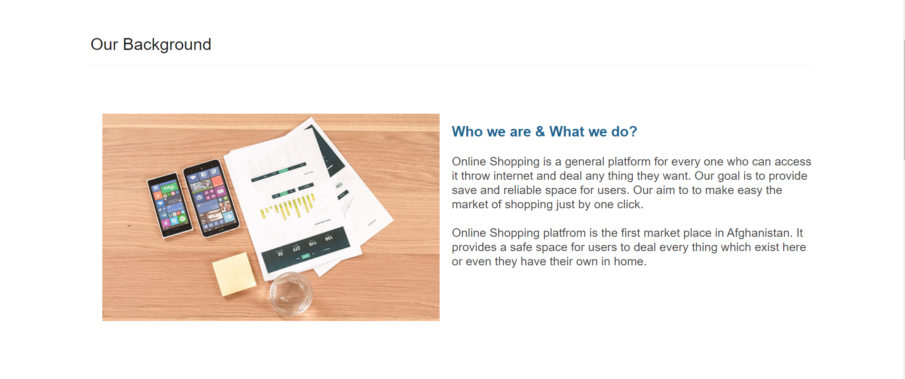
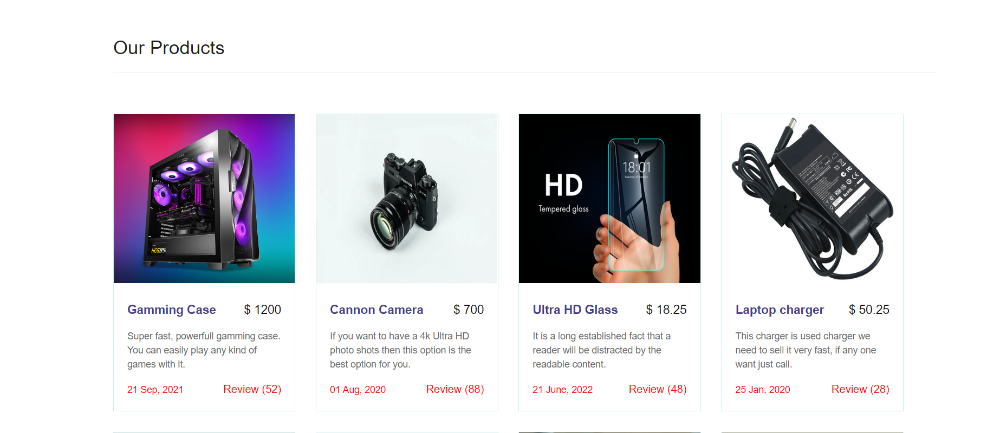
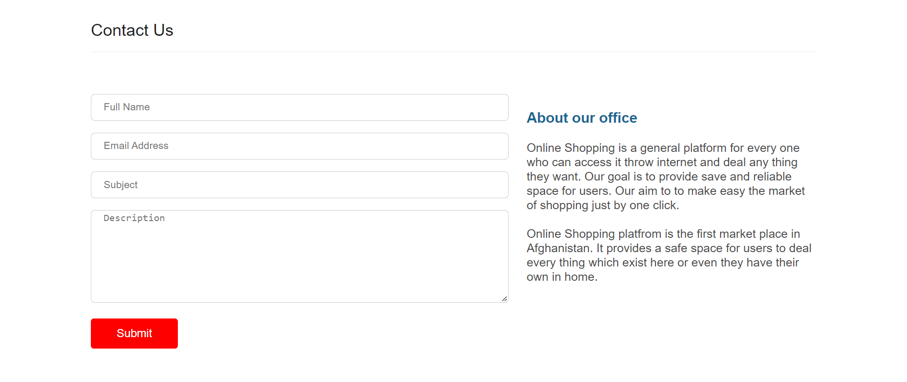

## Online Shopping

The brief was to develop a static front end project with a minimum of three separate page areas using HTML and CSS while following UX industry conventions. This is an online shopping platrom for making super easy the shopping market.

<a href="https://ray-yar.github.io/online-shopping/" target="_blank">Visit the live project here</a>

 

Online Shopping is a general platform for every one who can access it throw internet and deal any thing they want. Our goal is to provide save and reliable space for users.Our aim is to make easy the market of shopping just by one click. Online Shopping platfrom is the first market place in Afghanistan. It provides a safe space for users to deal every thing which exist here or even they have their own in home.

**This website is made up of the following pages:**
1. Home Page
2. More Products Page
3. Contat Us Page

**The main objectives for establishing an online platform are:**
1. Promoting a service or product online.
2. Selling a service or product.
3. Providing product support or customer service.
4. Providing corporate information.
5. Establishing brand awareness and corporate identity.

**These users are looking for:**
1. Their favorite product which is listed in products page.
2. Cartting and then purchase their favorite product.
3. A safe and reliable area for making their deals.
4. Guarantee items which are listed in website.
6. A user fiendly interface for searching their favorite product.

## UX/UI
For UX strategy first started to think about the strategy for this website and defined who the target users would be and what features/technologies they would want. My strategy for the site was to provide reputable content and ease of access to users trying to attain information by utilising key UX principals.

**Ideal users of this website:**
1. Sellers who want to sell their products.
2. Buyers who want to buy new products.
3. Managers who are managing the activities during the deals.
4. Admin who is the owner of this website.  

## Features
Online shopping website a general website which is access able for all users. In this website we have added three main pages. That each of them are necessary for an online website. i.e Home Page in this page a basic landing page is created to show the main aim of a website like there scope or visoin or any thing elese so this part is very good to define what we need to declare for a user. And then their is Product page, this page can list the whole products which is in our website. Contact Page, this page is also improtant to get users feedback about the process of our work.

## Existing Features

**Navigation Bar**
Here it containts a navigation bar which has a logo in left side and list of screen tabs in right side. Every thing is fully responsive like logo and navigation bar. It can easily fix it self with the width of diffrent devices.

 

**Slider**

This secion is very good for describing the vision, mession and scope of our website that every body when they log into to the website they should know that what this website is stand on. This contains one company photo as background to the users can see the team how we are working.

 

**About Us**

This section has a common instruction about the our company and how it works, and why it works. Thic section contains creation date and many other instructions about company. And also how this website works. It help users to know where they are dealing, so they will be more comfort while using this website. This section has a photo in left side and contents in right side. This is responsive in each devices and works as smooth as it can be.

 

**Products**

This section list all products which are listed in our website, In home page their is only few of products but id "More Product" Page there is all products listed which is available for dealing and shopping.

This section has a product photo and the name of that photo, price, description, posted date and review count. This info about proudct help users to know what product is this. This will also help users to access to their favorite product very fast.

This section is also responsive and it is working in multi devices without any crashes. This photo is at the top to be visible very good. The title and price is under phot and desction, other details are at the bottom of the product card.

 

**Contact Us**

This section helps users to get it touch with the managers of the website, this is a very good place for users to get contact with the owners of the website. i.e When a user wants to pay for a product but their is some problem so they can easily contact with managers and fix it as soon as posible. Or, maybe some crash reports. Or even some new feature suggestions to be added in the website. 

This section is also responsive. It contains Name, Email, Subject and the message the user want to send for website owners. And a bried instruction about the company for users.

 

**Footer**

This sectino has a copyright for other users to know that copping of this website will cause many problems for them. The coppy rith text is aligned in center and it is fully responsive.

 

